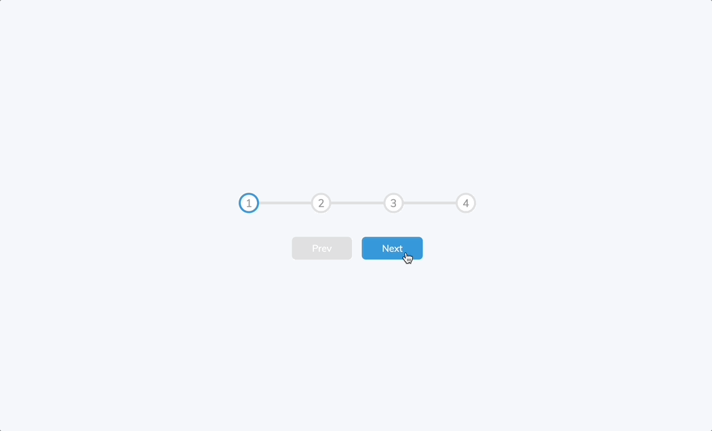

# Progress Steps

This mini project demonstrates a simple progress steps interface using **HTML**, **CSS**, and **JavaScript**. The progress bar dynamically updates as the user navigates through the steps, visually reflecting the current step.

## Preview

## Course Information

This project is part of the 50 Projects In 50 Days - HTML, CSS & JavaScript course on Udemy, created by Brad Traversy & Florin Pop.
